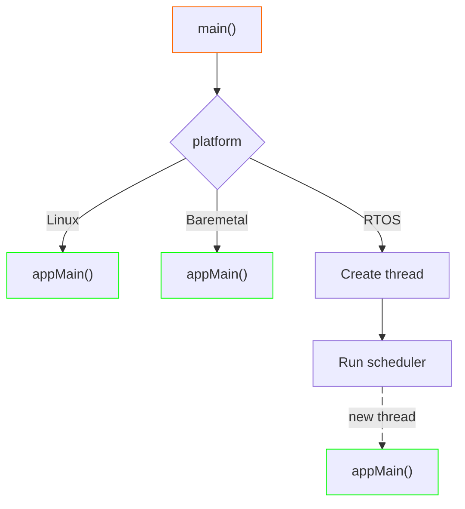

# platform

A CMake-based bootstrap framework that enables building C/C++ projects for Linux and baremetal platforms (with or
without RTOS) from a single codebase. It provides toolchain configuration via CMake variables and platform-specific
entry point abstraction through a unified `appMain()` interface.

Main features:

* **toolchain setup:** configures compiler, architecture flags, and build settings for target platform via CMake
  toolchain files,
* **unified main():** provides platform-specific `main()` implementations that invoke application-defined `appMain()`
  function.

> [!IMPORTANT] `platform` requires target project to use CMake. Several CMake trait are used, which require target
> project to use CMake in canonical way

## Overview

### Toolchain Setup

Toolchain configuration is controlled by 2 CMake variables (typically set via CMake presets):

* `PLATFORM` - selects platform from the list of supported ones,
* `TOOLCHAIN` - selects toolchain among those supported by given platform.

These variables select the appropriate toolchain file from `lib/toolchain/<platform>/` which configures the compiler,
supporting tools and defines architecture-specific flags (e.g., `-mcpu=cortex-m4 -mthumb` for ARM).

> [!NOTE] For Linux `platform` provides also options to enable code coverage and sanitizers.

### Unified `main()`

Application code implements `appMain(int argc, char* argv[])` instead of `main()`. The platform-specific `main()`
implementation is linked via `find_package(platform COMPONENTS main)` and handles platform initialization before calling
`appMain()`. On Linux, this is a direct passthrough of arguments. On baremetal platforms, `main()` constructs synthetic
arguments. On RTOS platforms, `main()` creates a task wrapper around `appMain()` and starts the scheduler. This
separation allows identical application code to run across all supported platforms without modification.



## Repository Structure

```txt
platform/
├── cmake/                          # CMake build system
│   ├── compilation-flags.cmake     # Internal compilation flags
│   ├── modules/                    # Modules for dependencies
│   └── presets/                    # Internal presets helpers
├── lib/                            # Core components
│   ├── main/                       # appMain entrypoint for given platform
│   │   ├── linux/                  # Entrypoint for Linux
│   │   ├── baremetal-arm/          # Entrypoint for baremetal on ARM
│   │   └── freertos-arm/           # Entrypoint for FreeRTOS on ARM
│   ├── package/                    # Component with repo build, version and git info
│   └── toolchain/                  # Toolchain configurations
│       ├── linux/                  # Toolchain configs for Linux
│       ├── baremetal-arm/          # Toolchain configs for baremetal on ARM
│       └── freertos-arm/           # Toolchain configs for FreeRTOS on ARM
├── examples/                       # Examples of platform usage
├── tools/                          # Internal tools and scripts
├── .devcontainer/                  # Devcontainers configs
├── .github/workflows/              # GitHub Actions configs
└── CMakePresets.json               # Development CMake presets
```

## Development

### Commands

* Configure CMake: `cmake --preset <preset_name> -B out/build/<preset_name>`
* Build: `cmake --build out/build/<preset_name>`
