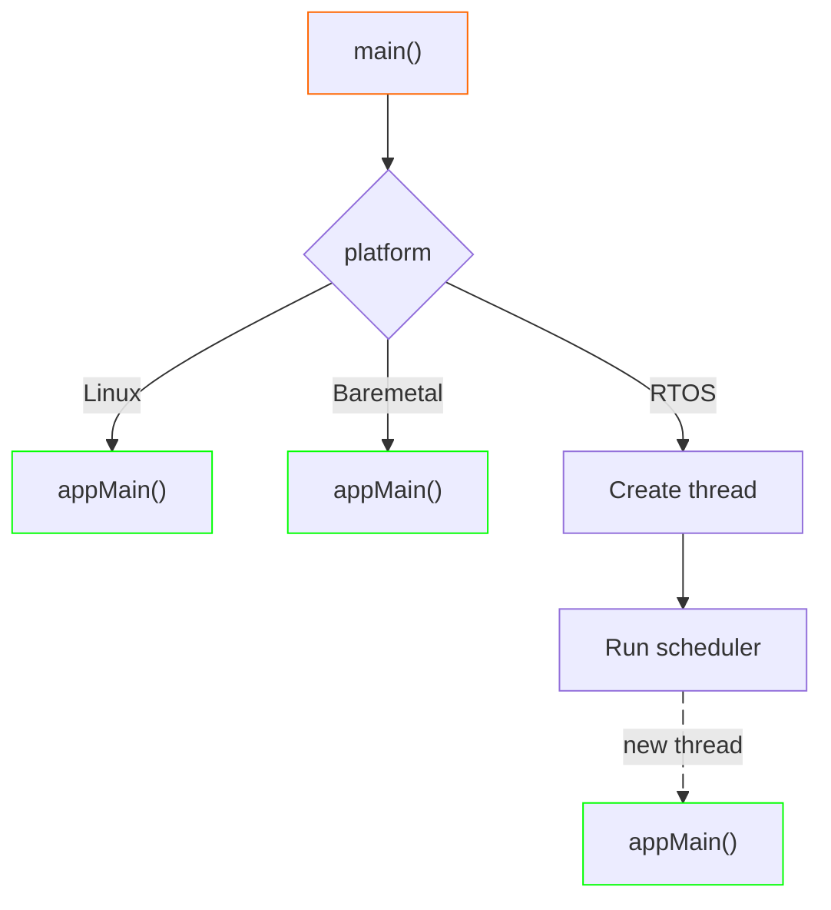

# platform

A CMake-based bootstrap framework that enables building C/C++ projects for Linux and baremetal platforms (with or
without RTOS) from a single codebase. It provides toolchain configuration via CMake variables and platform-specific
entry point abstraction through a unified `appMain()` interface.

Main features:

* **toolchain setup:** configures compiler, architecture flags, and build settings for target platform via CMake
  toolchain files,
* **unified main():** provides platform-specific `main()` implementations that invoke application-defined `appMain()`
  function.

> [!IMPORTANT]
> `platform` requires target project to use CMake.

## Architecture

### Components

* **`toolchain`:**
  * Configures compiler and architecture flags via `PLATFORM` + `TOOLCHAIN` CMake variables from the list of supported
    ones.
  * On Linux, additionally allows enabling sanitizer (`asan`, `lsan`, `tsan`, `ubsan`) and code coverage support.
* **`main`:**
  * Provides platform-specific `main()` that calls application-defined `appMain()`.
  * On Linux, an optional `platform::main-paths` target exposes API for getting install, config, and data root paths.
* **`package`:**
  * Exposes build-time metadata (compiler, build type) and git metadata (e.g. tag, branch, commit), regenerated at every
  CMake reconfiguration.

> [!IMPORTANT]
> Only components explicitly referenced by `find_package(platform COMPONENTS ...)` are processed by CMake
> and those referenced by `target_link_libraries()` are actually built.

#### `main`

The `main` component abstracts the entry-point dispatch across all supported platforms:



### Technologies

* **Language**: C++23, C17
* **Build System**: CMake (minimum version 3.28)
* **Documentation**: MkDocs with Material theme
* **Static Analysis**: clang-format, clang-tidy
* **CI/CD**: GitHub Actions

### Repository Structure

`platform` follows standard `kubasejdak-org` repository layout for C++ library:

```bash
platform/
├── cmake/                          # CMake build system
│   ├── compilation-flags.cmake     # Internal compilation flags
│   ├── modules/                    # CMake Findxxx.cmake modules for dependencies
│   └── presets/                    # Internal presets helpers
├── lib/                            # Core components
│   ├── main/                       # appMain() entrypoint for given platform
│   │   ├── linux/                  # Entrypoint for Linux
│   │   ├── baremetal-arm/          # Entrypoint for baremetal on ARM
│   │   └── freertos-arm/           # Entrypoint for FreeRTOS on ARM
│   ├── package/                    # Component with repo build, version and git info
│   └── toolchain/                  # Toolchain configurations
│       ├── linux/                  # Toolchain configs for Linux
│       ├── baremetal-arm/          # Toolchain configs for baremetal on ARM
│       └── freertos-arm/           # Toolchain configs for FreeRTOS on ARM
├── examples/                       # Examples of platform usage
├── tools/                          # Internal tools and scripts
├── .devcontainer/                  # Devcontainers configs
├── .github/workflows/              # GitHub Actions configs
└── CMakePresets.json               # Development CMake presets
```

## Usage

Integrate `platform` into a CMake project by pointing to its `Find` module and requesting the required components.

### CMake Integration

Create `Findplatform.cmake` module (typically in `cmake/modules` directory):

```cmake
include(FetchContent)
FetchContent_Declare(platform
    GIT_REPOSITORY  https://github.com/kubasejdak-org/platform.git
    GIT_TAG         dea2a14ea9acdde6a258b055b6b5a9ec0791e7b9
    SOURCE_SUBDIR   lib
)

FetchContent_MakeAvailable(platform)
include(${platform_SOURCE_DIR}/cmake/components.cmake)
```

This will allow defining which `platform` version should be used. It will also automatically download repo into build
directory.

Then, add directory containing that file to CMake search paths and use required components:

```cmake
list(APPEND CMAKE_MODULE_PATH "${CMAKE_CURRENT_SOURCE_DIR}/cmake/modules")

...

find_package(platform COMPONENTS toolchain)     # Must be requested before project()

project(myproject)

...

find_package(platform COMPONENTS main package)  # Other components can be requested after project()
```

### Configuration

Control platform selection via CMake variables (typically in `CMakePresets.json`):

| Variable           | Purpose                                       | Examples                                 |
| ------------------ | --------------------------------------------- | ---------------------------------------- |
| `PLATFORM`         | Target platform                               | `linux`, `baremetal-arm`, `freertos-arm` |
| `TOOLCHAIN`        | Compiler toolchain                            | `gcc`, `clang`, `arm-none-eabi-gcc`      |
| `FREERTOS_VERSION` | FreeRTOS kernel version (`freertos-arm` only) | `freertos-10.2.1`                        |

### Implementing `appMain()`

Implement `appMain()` instead of `main()` in the application:

```cpp
#include <cstdlib>

int appMain(int argc, char* argv[])
{
    // Application code
    return EXIT_SUCCESS;
}
```

### Linking

```cmake
target_link_libraries(my-app
    PRIVATE
        platform::main          # Provides main() → appMain() dispatch
)
```

> [!TIP]
> See [examples/](examples/) for complete, per-platform integration examples.

## Development

> [!NOTE]
> This section is relevant when working with `platform` itself, in standalone way. However presets used to build
> `platform` tests and examples can be used as a reference for dependent projects.

### Commands

* **Configure:** `cmake --preset <preset-name> . -B out/build/<preset-name>`
* **Build:** `cmake --build out/build/<preset-name> --parallel`
* **Run tests:** `cd out/build/<preset-name>/bin; ./<binary-name>`
* **Reformat code:** `tools/check-clang-format.sh`
* **Run linter:** `cd out/build/<preset-name>; ../../../tools/check-clang-tidy.sh`
  * Must be launched with clang preset (usually in clang devcontainer)

### Available CMake Presets

* **Native Linux**:
  * **Dependencies provided by target system:** `linux-native-{gcc,clang}-{debug,release}`
* **Cross-compilation**:
  * **Generic ARM64:** `linux-arm64-{gcc,clang}-{debug,release}`
  * **Yocto (via SDK):** `yocto-sdk-{gcc,clang}-{debug,release}`
  * **Baremetal ARMv7:** `baremetal-armv7-*-gcc-{debug,release}`
  * **FreeRTOS ARMv7:** `freertos-armv7-*-gcc-{debug,release}`
* **Sanitizers**: `*-{asan,lsan,tsan,ubsan}` variants

> [!NOTE]
> For local development use `linux-native-conan-gcc-debug` preset.

### Code Quality

* **Zero Warning Policy:** All warnings treated as errors
* **Code Formatting:** clang-format with project-specific style checked
* **Static Analysis:** clang-tidy configuration checked
* **Coverage:** Code coverage reports generated
* **Valgrind:** Tests and examples run under valgrind
* **Sanitizers:** Address, leak, thread, and undefined behavior sanitizers checked

### Important Notes

1. **Component Structure**: Each component is a separate, reusable module with the following structure:
   * `<component>/include/platform/<component>/`: public headers
   * `<component>/`: private implementation files
   * `<component>/CMakeLists.txt`: component configuration
2. **Testing**: Always run tests when making changes. Test fixtures are well-established.
3. **Dependencies**: Be careful with dependency management. This project has specific version requirements.
4. **Code Style**: Follow the established patterns. The project has strict formatting and static analysis rules.
5. **Error Handling**: Always use `std::error_code` for error reporting, never exceptions.
6. **Documentation**: Update documentation when adding new components or changing APIs.
7. **Namespace**: All code should be in the `platform::` namespace hierarchy.
